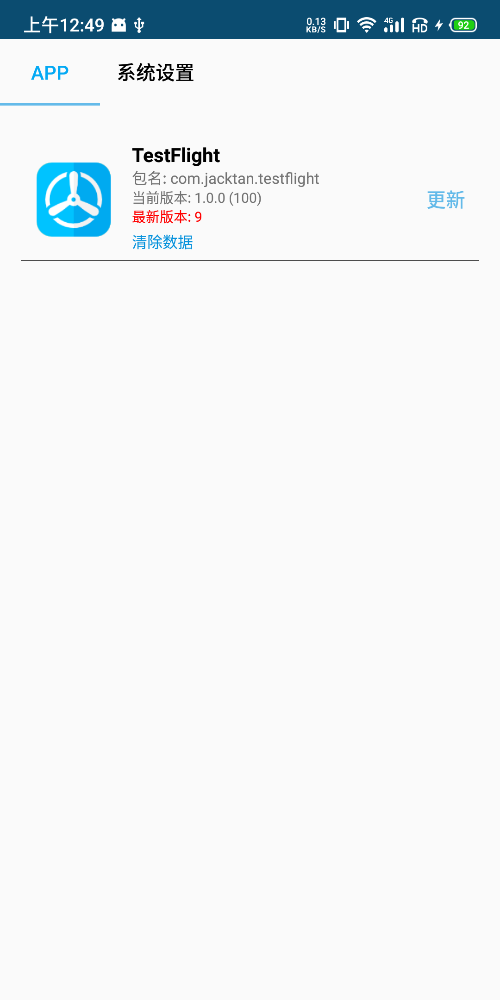
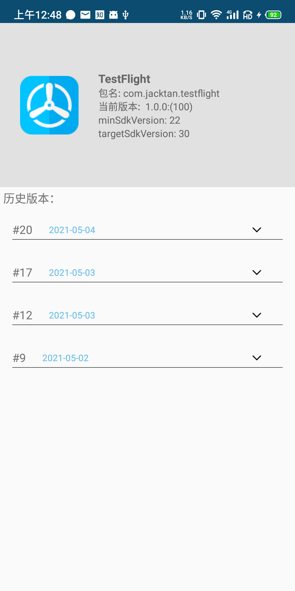
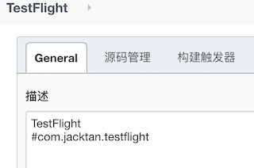

## 基于Jenkins构建产物的TestFlight

原理： 使用jenkins api，读取job列表，job详情
实现功能：
1. apk下载安装
2. job历史构建查看和安装

 
 
 
### Jenkins配置过滤



#### 账号
Constant.kt  
```kotlin
    var BASE_URL = "http://build.jacktan.tech:5000"
    var JENKINS_USER = "testflight"
    var JENKINS_PASSWD = "123456"
```

